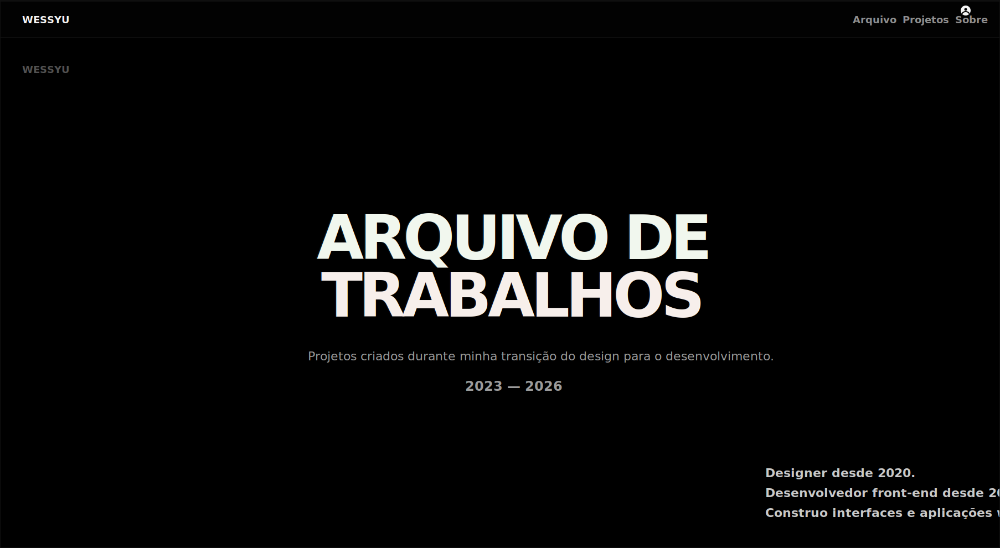

# WESSYU-ARQUIVO

<p align="center">
  
</p>

Portfólio pessoal desenvolvido para apresentar projetos selecionados construídos durante a transição do design para o desenvolvimento front-end.

**Acesso:** https://portifoliowess.netlify.app

## Sobre

Este projeto foi pensado como um arquivo de trabalhos, não como um currículo tradicional.

Cada projeto apresenta contexto, problema, solução, decisões de implementação e resultado final.

## Projetos Selecionados

### Receitas
Plataforma de receitas com autenticação, favoritos, perfil de usuário e painel administrativo.

### DevMatch
Conceito de plataforma para conexão entre desenvolvedores e contratantes.

### Logic Quest
Experiência de aprendizado inspirada em IDEs para ensino de lógica de programação.

### HELENA
Sistema administrativo focado em organização de processos e informações.

### Differenza
Redesign conceitual para salão e barbearia com foco em experiência digital premium.

## Tecnologias

<p align="center">
  
</p>

## Executando Localmente

```bash
npm install
npm run dev
```

## Build

```bash
npm run build
npm run preview
```

## Contato

GitHub: https://github.com/WessYu

LinkedIn: https://linkedin.com/in/wesleycruz

Email: wess.c@proton.me